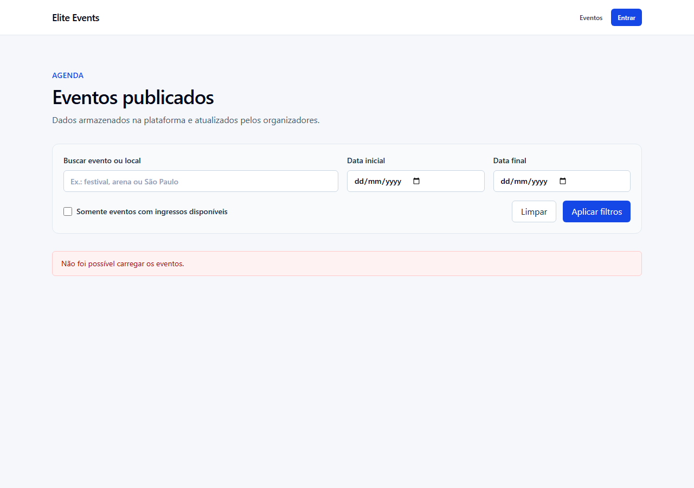
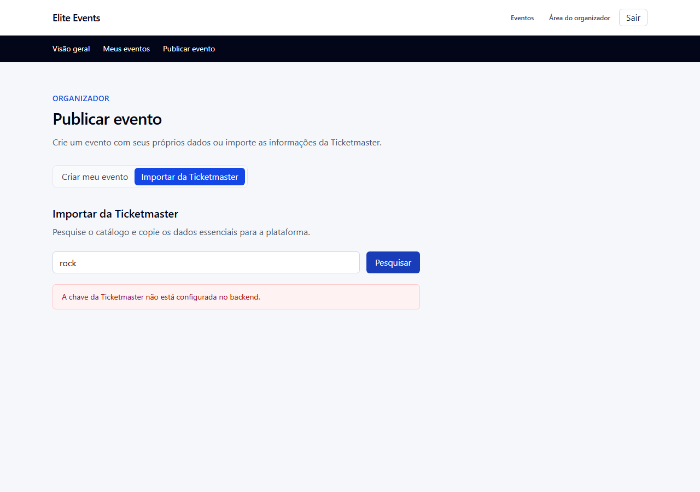
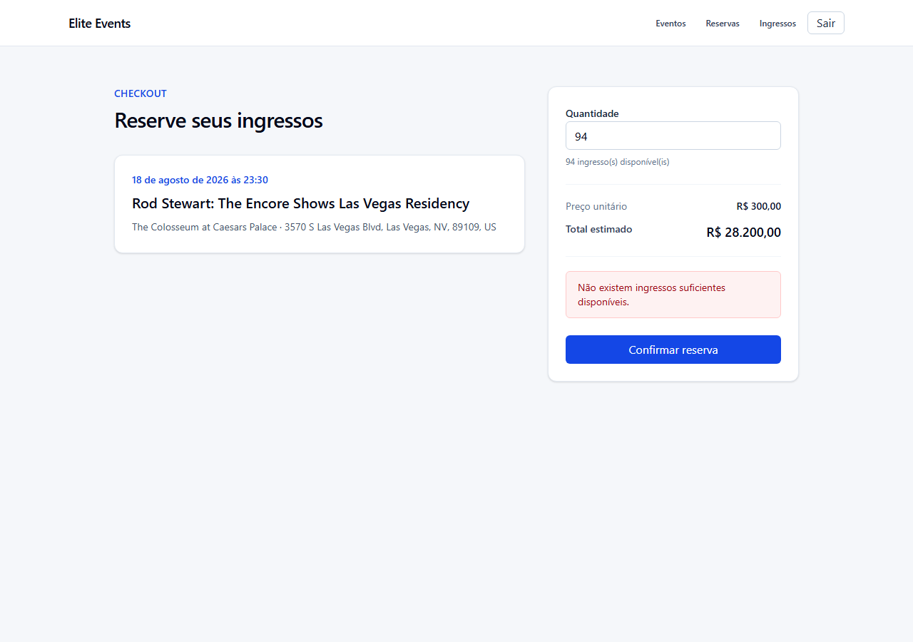
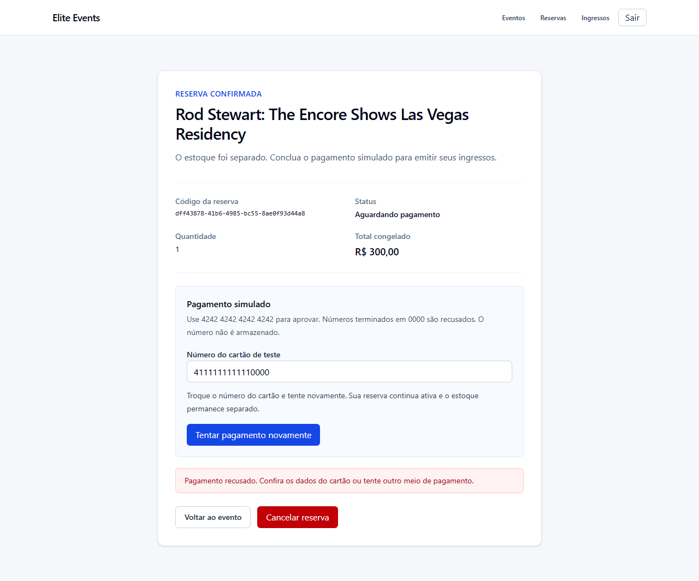
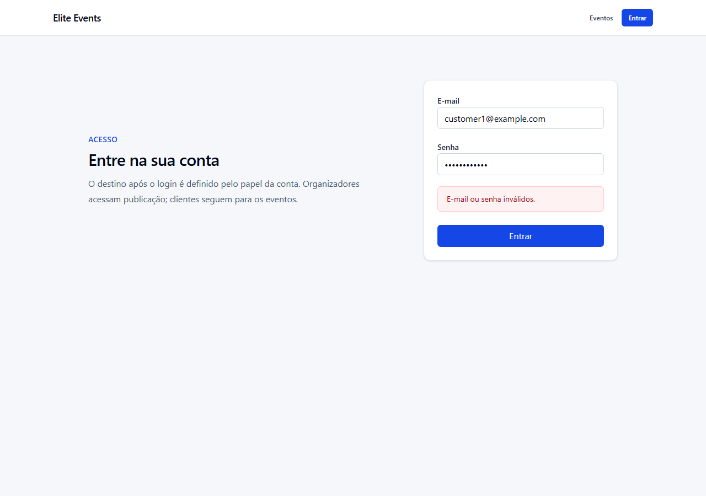
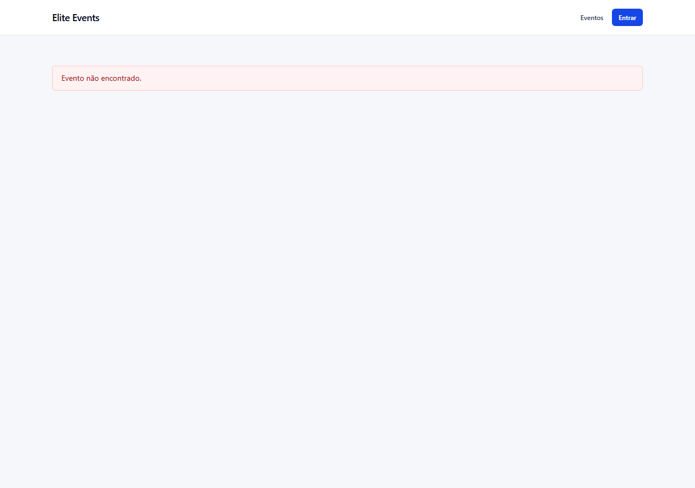
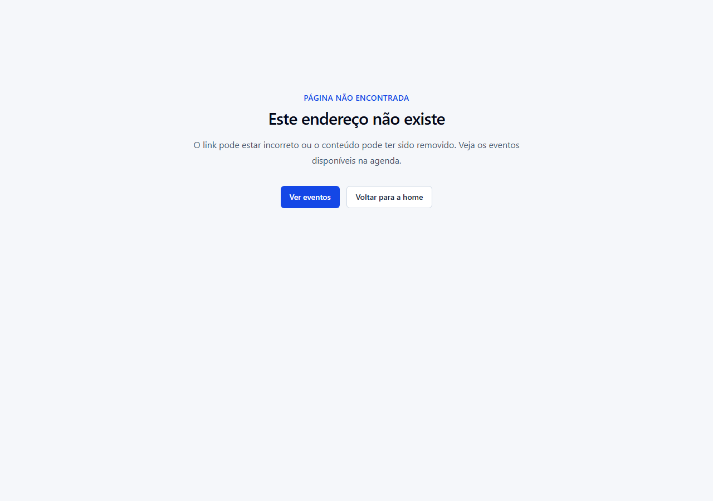
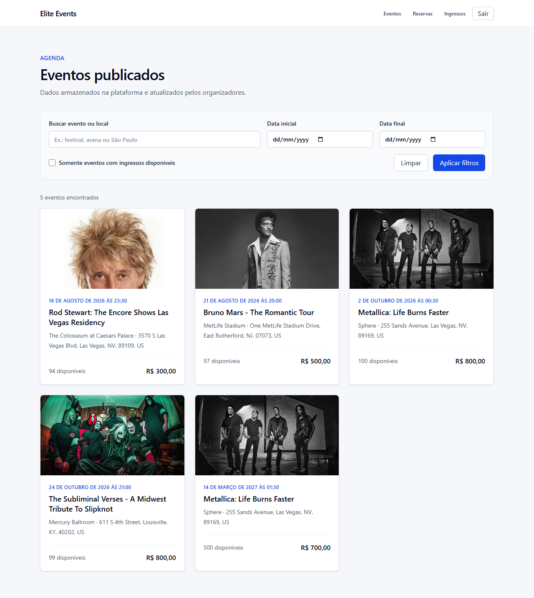
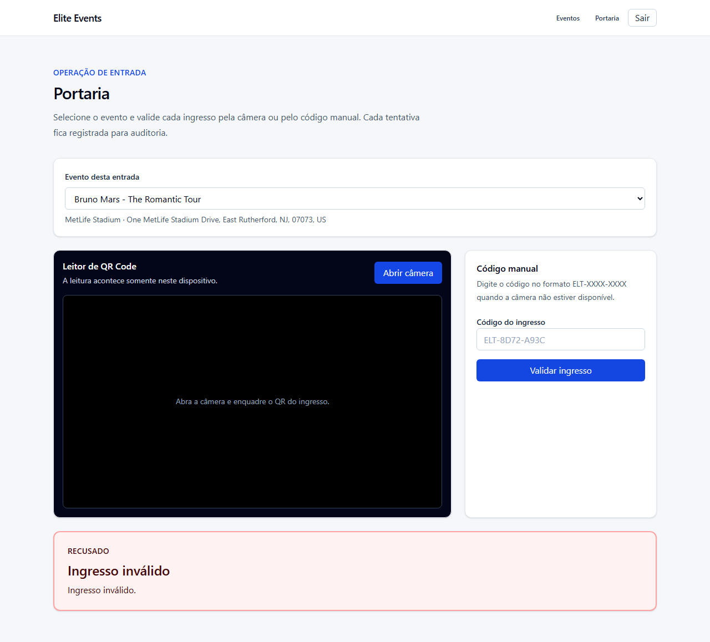

# Catálogo de erros

Este documento lista todos os erros que o backend pode retornar, o status HTTP de cada um, a mensagem exata que o usuário recebe e como ela aparece na interface. Ele foi extraído do código com análise de AST, não escrito de memória: são **92 pontos de erro** distribuídos em **51 códigos distintos**.

## O contrato

Toda falha sai no mesmo formato, definido em `backend/app/core/exceptions.py`:

```json
{
  "error": {
    "code": "INSUFFICIENT_TICKETS",
    "message": "Não existem ingressos suficientes disponíveis."
  }
}
```

O frontend nunca interpreta texto livre: lê `code` quando precisa decidir algo e exibe `message` quando precisa falar com o usuário. O teste `backend/app/tests/test_error_contract.py` garante o formato.

### Quem produz a resposta

O FastAPI registra quatro handlers em `backend/app/main.py`:

| Handler | Captura | Produz |
|---|---|---|
| `app_error_handler` | `AppError` | O `code`, `message` e status definidos no service |
| `validation_error_handler` | `RequestValidationError` | `VALIDATION_ERROR` / 422 |
| `http_exception_handler` | `StarletteHTTPException` | `NOT_FOUND` / 404, `METHOD_NOT_ALLOWED` / 405, `HTTP_ERROR` para os demais |
| `unhandled_exception_handler` | `Exception` | `INTERNAL_ERROR` / 500 |

O quarto handler é a rede de segurança: qualquer falha não prevista — queda do PostgreSQL, bug, biblioteca lançando algo inesperado — sai no mesmo contrato. A causa real vai apenas para o log do servidor, com `exc_info` e o caminho da requisição já redigido pelo mesmo filtro que protege os links de compartilhamento. A resposta nunca carrega mensagem de exceção, stack trace ou nome de tabela.

Por isso a aplicação **não** liga o modo `debug` do Starlette. Com `debug=True`, o `ServerErrorMiddleware` responde o traceback completo — incluindo caminhos absolutos do disco — e ignora qualquer handler registrado. Como `debug` derivava de `ENVIRONMENT`, cujo padrão é `development`, bastaria publicar sem definir a variável para expor o rastro de execução pela rede. O traceback continua disponível no terminal, via log.

O `validation_error_handler` descarta deliberadamente o detalhe do Pydantic. O corpo bruto apontaria nomes de campo internos e tipos esperados; o usuário recebe apenas `"Os dados enviados são inválidos."` e o formulário no frontend já valida com Zod antes de enviar.

## Como a mensagem chega na tela

`frontend/src/services/api.ts` converte qualquer resposta não-OK em `ApiError`, preservando `code`, `message` e `status`. Quando o corpo não é JSON — servidor caído, proxy, HTML de erro — usa o fallback `REQUEST_FAILED` com `"Não foi possível concluir a solicitação."`.

Todos os 19 pontos de exibição do frontend usam a mesma guarda:

```tsx
error instanceof ApiError ? error.message : "Não foi possível carregar o evento."
```

Isso é o que impede vazamento técnico. Um `TypeError: Failed to fetch` — que é o que o navegador lança quando o backend está fora do ar — não é `ApiError`, então cai no texto amigável em português em vez de aparecer como está. A mensagem do `else` é específica de cada tela.

A renderização usa três componentes de `frontend/src/components/ui/feedback.tsx`: `ErrorMessage` (caixa vermelha, `role="alert"`), `LoadingState` e `EmptyState`.

### Quando a falha escapa do fluxo de dados

As guardas acima cobrem erros de requisição. Uma exceção durante a renderização não passa por elas, então o App Router tem três arquivos de fronteira:

| Arquivo | Cobre | Oferece |
|---|---|---|
| `app/error.tsx` | Erro de renderização em qualquer rota | "Tentar novamente" (`reset`) e voltar para a home |
| `app/global-error.tsx` | Erro no próprio layout raiz | Recarregar; renderiza `html` e `body` próprios, sem depender de provider |
| `app/not-found.tsx` | Rota inexistente | Caminho para a agenda de eventos |

Nenhum dos três exibe `error.message`: o texto de uma exceção de renderização pode conter detalhe interno. A causa vai para o console do navegador. Quando o Next.js fornece um `digest`, ele aparece como "código da ocorrência" — identifica a falha no log do servidor sem revelar o que aconteceu.

### Enums nunca vão crus para a tela

Todo valor de enum da API é traduzido antes de aparecer: `reservationStatusLabels` em `frontend/src/utils/format.ts` cobre o status da reserva no checkout e no cartão de reservas, e `resultLabels` / `resultEyebrows` cobrem os quatro resultados da portaria. O cliente lê "Aguardando pagamento", não `PENDING`.

---

## Catálogo por módulo

### Autenticação e autorização

| Código | HTTP | Mensagem | Quando dispara |
|---|---|---|---|
| `INVALID_CREDENTIALS` | 401 | E-mail ou senha inválidos. | Login com e-mail inexistente ou senha errada |
| `INVALID_CREDENTIALS` | 401 | Token inválido ou expirado. | JWT malformado, assinatura inválida ou expirado |
| `INVALID_CREDENTIALS` | 401 | Autenticação necessária. | Rota protegida sem header `Authorization` |
| `FORBIDDEN` | 403 | Você não tem permissão para esta ação. | Papel do usuário não autorizado na rota |
| `EMAIL_ALREADY_REGISTERED` | 409 | Já existe uma conta com este e-mail. | Cadastro com e-mail já usado |

Na tela: a página de login exibe `ErrorMessage` acima do formulário. Os guards (`customer-guard`, `organizer-guard`, `gate-guard`) redirecionam antes de renderizar conteúdo protegido, então o 403 raramente chega à interface por navegação normal.

### Catálogo Ticketmaster

| Código | HTTP | Mensagem | Quando dispara |
|---|---|---|---|
| `CATALOG_NOT_CONFIGURED` | 503 | A chave da Ticketmaster não está configurada no backend. | `TICKETMASTER_API_KEY` ausente |
| `CATALOG_UNAVAILABLE` | 504 | O catálogo externo demorou demais para responder. | Timeout do HTTPX |
| `CATALOG_UNAVAILABLE` | 502 | Não foi possível acessar o catálogo externo. | Falha de rede ou DNS |
| `CATALOG_UNAVAILABLE` | 502 | O catálogo externo está temporariamente indisponível. | Ticketmaster respondeu 5xx |
| `CATALOG_AUTHENTICATION_FAILED` | 502 | A Ticketmaster recusou a credencial configurada. | Ticketmaster respondeu 401 |
| `CATALOG_RATE_LIMITED` | 503 | O limite de consultas ao catálogo foi atingido. | Ticketmaster respondeu 429 |
| `CATALOG_INVALID_RESPONSE` | 502 | O catálogo externo retornou uma resposta inválida. | Corpo não é JSON |
| `CATALOG_NOT_FOUND` | 404 | Evento externo não encontrado. | Busca sem resultado |
| `EXTERNAL_EVENT_NOT_FOUND` | 404 | Evento externo não encontrado. | Publicação de ID externo inexistente |
| `CATALOG_DATA_INCOMPLETE` | 422 | O evento externo não possui os dados necessários para publicação. | Item sem data, local ou preço |

Esta é a família mais importante para a pergunta *"e se a API externa cair?"*. Nenhuma dessas falhas derruba a aplicação: o componente de importação mostra `ErrorMessage` e a agenda pública continua servindo os eventos já publicados, porque eles foram copiados para o PostgreSQL no momento da publicação.

### Eventos

| Código | HTTP | Mensagem | Quando dispara |
|---|---|---|---|
| `EVENT_NOT_FOUND` | 404 | Evento não encontrado. | ID inexistente ou evento não publicado |
| `EVENT_ALREADY_PUBLISHED` | 409 | Este evento externo já foi publicado por você. | Republicação do mesmo ID externo |
| `EVENT_HAS_RESERVATIONS` | 409 | Eventos com reservas não podem ser removidos. | Exclusão com reservas ativas |
| `INVALID_EVENT_CAPACITY` | 409 | A capacidade não pode ser menor que a quantidade já reservada. | Redução de capacidade abaixo do vendido |
| `SEAT_MAP_CAPACITY_LOCKED` | 409 | Remova ou reconfigure o mapa antes de alterar a capacidade. | Mudança de capacidade com mapa ativo |
| `INVALID_EVENT_IMAGE` | 422 | Envie uma imagem JPEG, PNG ou WebP válida. | Upload com tipo inválido |
| `EVENT_IMAGE_TOO_LARGE` | 413 | A imagem deve ter no máximo 5 MB. | Upload acima do limite |
| `EVENT_CREATION_FAILED` | 409 | Não foi possível criar o evento. | Violação de constraint na inserção |

### Reservas

| Código | HTTP | Mensagem | Quando dispara |
|---|---|---|---|
| `EVENT_SOLD_OUT` | 409 | Os ingressos deste evento estão esgotados. | `available_tickets` zerado |
| `INSUFFICIENT_TICKETS` | 409 | Não existem ingressos suficientes disponíveis. | Quantidade pedida acima do estoque |
| `SEAT_SELECTION_REQUIRED` | 409 | Escolha os lugares no mapa de assentos antes de reservar. | Reserva por quantidade em evento `ASSIGNED` |
| `RESERVATION_NOT_FOUND` | 404 | Reserva não encontrada. | ID inexistente ou de outro cliente |
| `RESERVATION_CANNOT_BE_CANCELLED` | 409 | Esta reserva não pode mais ser cancelada. | Cancelamento de reserva já paga, expirada ou cancelada |
| `RESERVATION_CANCELLATION_FAILED` | 409 | Não foi possível cancelar a reserva. | Falha transacional no cancelamento |
| `RESERVATION_CANCELLATION_FAILED` | 409 | Não foi possível carregar a reserva cancelada. | Releitura falhou após o cancelamento |
| `RESERVATION_FAILED` | 409 | Não foi possível criar a reserva. | Falha transacional na criação |
| `RESERVATION_FAILED` | 409 | Não foi possível carregar a reserva. | Releitura falhou após a reserva de assentos |

`EVENT_SOLD_OUT` e `INSUFFICIENT_TICKETS` são a face visível da proteção contra overselling. Eles não são erros de validação: chegam **depois** do `SELECT FOR UPDATE`, quando a transação já enxergou o estoque confirmado. É por isso que retornam 409 e não 422 — o pedido era válido, o recurso é que acabou.

### Assentos marcados

| Código | HTTP | Mensagem | Quando dispara |
|---|---|---|---|
| `SEATS_UNAVAILABLE` | 409 | Um ou mais assentos acabaram de ficar indisponíveis. Atualize sua seleção. | Disputa pelo mesmo lugar |
| `SEAT_NOT_FOUND` | 404 | Um ou mais assentos não pertencem a este evento. | ID de assento inválido |
| `SEAT_MAP_NOT_CONFIGURED` | 404 / 409 | O mapa de assentos deste evento não está configurado. | Operação de mapa em evento sem mapa |
| `SEAT_MAP_NOT_CONFIGURED` | 404 / 409 | Este evento não utiliza assentos marcados. | Operação de mapa em evento por quantidade |
| `SEAT_MAP_LOCKED` | 409 | O mapa não pode ser alterado depois da primeira reserva de assento. | Edição de mapa em uso |
| `SEAT_MAP_LOCKED` | 409 | O mapa não pode ser removido depois da primeira reserva de assento. | Remoção de mapa em uso |
| `SEAT_MAP_CAPACITY_MISMATCH` | 409 | O mapa deve possuir exatamente {N} assentos. | Soma dos setores diferente da capacidade |
| `SEAT_MAP_ACTIVE_RESERVATIONS` | 409 | Cancele ou conclua as reservas ativas antes de criar o mapa. | Primeira configuração com reservas gerais ativas |
| `SEAT_HOLD_STATE_INVALID` | 409 | Os assentos reservados não estão disponíveis para pagamento. | Hold perdido antes do pagamento |
| `SEAT_HOLD_STATE_INVALID` | 409 | Os assentos ativos não correspondem à reserva. | Vínculo divergente ao cancelar ou reembolsar |
| `INSUFFICIENT_TICKETS` | 409 | Não existem assentos suficientes disponíveis. | Seleção maior que a oferta |
| `SEAT_MAP_CONFIGURATION_FAILED` | 409 | Não foi possível configurar o mapa de assentos. | Falha transacional ao criar o mapa |
| `SEAT_MAP_CONFIGURATION_FAILED` | 409 | Não foi possível carregar o mapa configurado. | Mapa desapareceu entre a escrita e a releitura |
| `SEAT_MAP_REMOVAL_FAILED` | 409 | Não foi possível remover o mapa de assentos. | Falha transacional na remoção |

A mensagem de `SEAT_MAP_CAPACITY_MISMATCH` é interpolada com a capacidade real do evento — é a única do catálogo que varia por dado, e isso é intencional: dizer *"o mapa deve possuir exatamente 850 assentos"* é acionável, enquanto *"capacidade incompatível"* não é.

### Pagamento e reembolso

| Código | HTTP | Mensagem | Quando dispara |
|---|---|---|---|
| `PAYMENT_DECLINED` | 402 | Pagamento recusado. Confira os dados do cartão ou tente outro meio de pagamento. | Cartão terminado em `0000` |
| `RESERVATION_NOT_PAYABLE` | 409 | Esta reserva não pode ser paga. | Reserva cancelada, expirada ou já paga |
| `RESERVATION_EXPIRED` | 409 | A reserva temporária expirou. Escolha os assentos novamente. | Hold vencido |
| `PAYMENT_STATE_INVALID` | 409 | A reserva paga não possui um pagamento aprovado. | Inconsistência de estado |
| `PAYMENT_STATE_INVALID` | 409 | A reserva paga não possui ingressos emitidos. | Inconsistência de estado |
| `PAYMENT_FAILED` | 409 | Não foi possível concluir o pagamento. | Falha transacional |
| `RESERVATION_NOT_REFUNDABLE` | 409 | Somente reservas pagas podem ser reembolsadas. | Reembolso de reserva não paga |
| `REFUND_WINDOW_EXPIRED` | 409 | O prazo de 7 dias para solicitar o reembolso terminou. | Fora da janela |
| `REFUND_EVENT_TOO_CLOSE` | 409 | O reembolso deve ser solicitado com pelo menos 48 horas de antecedência. | Evento próximo demais |
| `REFUND_TICKET_USED` | 409 | Reservas com ingresso já utilizado não podem ser reembolsadas. | Algum ticket `USED` |
| `REFUND_STATE_INVALID` | 409 | Todos os ingressos devem estar ativos para o reembolso integral. | Tickets em estado misto |
| `REFUND_STATE_INVALID` | 409 | A reserva não possui um pagamento aprovado para reembolso. | Inconsistência de estado |
| `REFUND_STATE_INVALID` | 409 | A reserva reembolsada não possui um reembolso aprovado. | Inconsistência de estado |
| `REFUND_STATE_INVALID` | 409 | A quantidade de ingressos emitidos não corresponde à reserva. | Inconsistência de estado |
| `REFUND_FAILED` | 409 | O reembolso não pôde ser concluído. Tente novamente. | Recusa do gateway |
| `REFUND_FAILED` | 409 | Não foi possível concluir o reembolso. | Falha transacional |

`PAYMENT_DECLINED` é o **único código pelo qual o frontend ramifica logicamente** (`frontend/src/components/reservations/checkout.tsx`): a recusa não é tratada como erro terminal. A reserva continua `PENDING` e a tela reapresenta o formulário para o cliente tentar outro cartão, em vez de mandá-lo recomeçar a compra. Os demais códigos apenas exibem a mensagem.

### Ingressos e compartilhamento

| Código | HTTP | Mensagem | Quando dispara |
|---|---|---|---|
| `TICKET_NOT_FOUND` | 404 | Ingresso não encontrado. | ID inexistente ou de outro dono |
| `TICKET_NOT_ACTIVE` | 409 | Somente ingressos ativos podem ser compartilhados. | Share de ticket usado ou reembolsado |
| `TICKET_NOT_ACTIVE` | 409 | O QR Code não está disponível para este ingresso. | QR de ticket inativo |
| `SHARED_TICKET_NOT_FOUND` | 404 | Ingresso compartilhado não encontrado ou indisponível. | Token de share inválido ou revogado |
| `INVALID_TICKET` | 409 | Não foi possível validar este ingresso. | Hash do QR não confere |

`SHARED_TICKET_NOT_FOUND` cobre deliberadamente dois casos distintos — token inexistente e token revogado — com a mesma resposta. Diferenciá-los permitiria a um visitante descobrir quais tokens já existiram.

### Portaria

A portaria é a exceção do catálogo: ela **não usa erros HTTP para os resultados de negócio**. `POST /api/v1/gate/validate` retorna 200 com um `result` no corpo.

| `result` | Rótulo na tela | Significado |
|---|---|---|
| `VALID` | Entrada liberada | Primeira validação bem-sucedida; ticket vira `USED` |
| `ALREADY_USED` | Ingresso já utilizado | Segunda leitura do mesmo QR |
| `WRONG_EVENT` | Ingresso de outro evento | Ticket válido, mas de evento diferente do selecionado |
| `INVALID` | Ingresso inválido | Assinatura adulterada, hash divergente ou código inexistente |

A escolha é deliberada: para a portaria, "ingresso já utilizado" é uma resposta **esperada** do fluxo, não uma falha da requisição. Tratá-la como 409 obrigaria o cliente a distinguir erro de transporte de resultado de negócio dentro do `catch`. O único erro HTTP real do módulo é `EVENT_NOT_FOUND` (404), quando o evento selecionado não existe.

Na tela, o resultado aparece num painel colorido por categoria, com `aria-live="assertive"` para leitores de tela.

---

## Erros que não vêm dos services

| Código | HTTP | Origem | Mensagem |
|---|---|---|---|
| `VALIDATION_ERROR` | 422 | Handler do Pydantic | Os dados enviados são inválidos. |
| `NOT_FOUND` | 404 | Handler do Starlette | Recurso não encontrado. |
| `METHOD_NOT_ALLOWED` | 405 | Handler do Starlette | Método não permitido. |
| `HTTP_ERROR` | vários | Handler do Starlette | Não foi possível concluir a solicitação. |
| `REQUEST_FAILED` | vários | Frontend | Não foi possível concluir a solicitação. |
| `INTERNAL_ERROR` | 500 | `unhandled_exception_handler` | Erro interno. Tente novamente em instantes. |

`REQUEST_FAILED` é o fallback do próprio `api.ts` quando a resposta não traz JSON no contrato — o caso de um proxy devolvendo HTML, por exemplo.

## Distribuição dos status

| Status | Ocorrências | Leitura |
|---|---|---|
| 409 | 50 | Conflito de estado — a maior família, própria de um domínio com concorrência |
| 404 | 25 | Recurso inexistente ou fora do escopo do usuário |
| 401 | 4 | Autenticação |
| 502 | 4 | Falha do catálogo externo |
| 503 | 2 | Catálogo não configurado ou com limite atingido |
| 422 | 2 | Entrada semanticamente inválida |
| 402, 403, 413, 504 | 1 cada | Pagamento recusado, permissão, upload grande, timeout externo |

A concentração em 409 é o dado mais revelador do domínio: quase toda falha real aqui é um conflito entre a intenção do usuário e o estado atual do banco — estoque acabou, assento foi tomado, ingresso já foi usado. São exatamente os casos que só um banco transacional resolve.

---

---

## Como cada erro aparece na tela

As imagens abaixo foram capturadas na aplicação em execução, com falhas reais provocadas de propósito. O roteiro que as gera está versionado em `scripts/screenshots/capturar-erros.mjs` e pode ser reexecutado a qualquer momento:

```powershell
docker compose up -d
cd scripts/screenshots
npm install && npx playwright install chromium
npm run capturar
```

Cada captura é ancorada no texto que prova o erro, não num seletor genérico: se a mensagem mudar, o roteiro falha em vez de gerar uma imagem enganosa. O roteiro devolve o estoque que consome, então execuções repetidas não alteram o seed.

### Falha de conexão com o backend

O contêiner do backend é derrubado antes desta captura. O navegador lança `TypeError: Failed to fetch`, que não é `ApiError`, então a guarda cai no texto amigável específico da tela. O TanStack Query ainda repete a requisição algumas vezes antes de desistir — por isso o erro leva alguns segundos para aparecer.



### Catálogo externo indisponível

Sem `TICKETMASTER_API_KEY`, o backend responde `CATALOG_NOT_CONFIGURED` (503). A mesma tela cobre timeout, 429 e 5xx da Ticketmaster, trocando apenas a mensagem. A agenda pública segue funcionando: os eventos publicados já estão no PostgreSQL.



### Estoque insuficiente — a prova de que o frontend não basta

Esta é a captura mais relevante do conjunto. O campo de quantidade limita o valor ao estoque que a **página carregou**. Aqui a página mostra 95 disponíveis e o cliente pede exatamente 95 — passa na validação do navegador. Enquanto a página estava aberta, outro cliente reservou parte do lote, e o `SELECT FOR UPDATE` no servidor recusou com `INSUFFICIENT_TICKETS`.

É o overselling sendo barrado no único lugar onde isso pode ser garantido: dentro da transação.



### Pagamento recusado

Cartão terminado em `0000` aciona a recusa do gateway simulado. A recusa **não é terminal**: a reserva continua `Aguardando pagamento`, o estoque segue separado e o botão muda para "Tentar pagamento novamente". É o único código pelo qual o frontend ramifica logicamente.



### Credenciais inválidas

`INVALID_CREDENTIALS` (401). A mesma mensagem cobre e-mail inexistente e senha errada, de propósito: distinguir os dois permitiria descobrir quais e-mails têm conta.



### Recurso inexistente

Duas situações diferentes, dois tratamentos.

`EVENT_NOT_FOUND` (404) — o identificador é válido, mas não existe evento publicado com ele:



Rota inexistente — nenhuma requisição chega a ser feita; quem responde é o `app/not-found.tsx`:



### Papel sem permissão

Um cliente autenticado tentando `/organizer/dashboard` é levado para a agenda pública antes de qualquer conteúdo do organizador renderizar. O guard atua no cliente por conveniência; a autorização real é do backend, que responde `FORBIDDEN` (403) mesmo se a rota for chamada diretamente.



### Portaria — ingresso inválido

Código digitado que não corresponde a nenhum ingresso. O painel usa cor, um rótulo curto legível de longe e `aria-live="assertive"`. Os outros três resultados (`VALID`, `ALREADY_USED`, `WRONG_EVENT`) usam o mesmo painel com cor e texto próprios.



## Auditoria: o que foi corrigido

A primeira versão deste documento nasceu de uma auditoria que encontrou quatro lacunas. Todas foram fechadas; o registro fica aqui porque o raciocínio é mais útil que o resultado.

**1. Exceção não prevista escapava do contrato.** `main.py` registrava handlers para `AppError`, `RequestValidationError` e `StarletteHTTPException`, mas não para `Exception`. Uma queda do PostgreSQL no meio da requisição produzia um 500 em texto puro. Corrigido com `unhandled_exception_handler`, coberto por `test_unexpected_exception_uses_standard_error_contract`.

**2. O modo `debug` expunha o traceback pela rede.** Achado durante a correção anterior, e mais grave que ela. `FastAPI(debug=...)` derivava de `ENVIRONMENT`, cujo padrão é `development`. Com `debug=True` o `ServerErrorMiddleware` responde o traceback completo — caminhos absolutos do disco incluídos — e **ignora qualquer handler registrado**. Publicar sem definir a variável bastaria para vazar o rastro de execução. A aplicação deixou de passar `debug` ao FastAPI; o traceback continua no log do servidor.

**3. O frontend não tinha fronteiras de erro.** Faltavam `error.tsx`, `global-error.tsx` e `not-found.tsx`; um erro de renderização caía na tela padrão do Next.js, técnica e em inglês. Os três foram criados.

**4. Enums e texto de gateway chegavam crus ao usuário.** O checkout exibia `PENDING` como status e a portaria exibia `ALREADY_USED` acima do rótulo amigável. Além disso, `PAYMENT_DECLINED` e `REFUND_FAILED` repassavam o `failure_reason` do gateway direto para a tela — seguro com o simulador, que responde em português, mas um provedor real devolveria `insufficient_funds`. Hoje a mensagem ao usuário é definida por nós; o texto do provedor continua persistido apenas para auditoria.

## Limites que permanecem

**Um 500 continua possível — e isso é correto.** Se o PostgreSQL cair, a resposta certa é 500. A garantia que este projeto oferece não é a ausência de 500, e sim que **nenhum 500 é não tratado**: todos seguem o contrato, nenhum expõe stack trace ou mensagem de exceção, todos aparecem no log do servidor com método, caminho e `exc_info`. Prometer "nunca dá 500" seria uma alegação que a primeira pergunta derruba.

**Não há retry automático nem circuit breaker** nas chamadas à Ticketmaster. Um timeout vira `CATALOG_UNAVAILABLE` e o organizador decide se tenta de novo. Para o volume do MVP isso basta; um catálogo instável justificaria backoff e um disjuntor.

**O `digest` do Next.js não é correlacionado com o log do backend.** As duas pontas registram falhas, mas não compartilham um ID de requisição. Rastrear um erro relatado por um usuário exige cruzar horário e rota manualmente.
